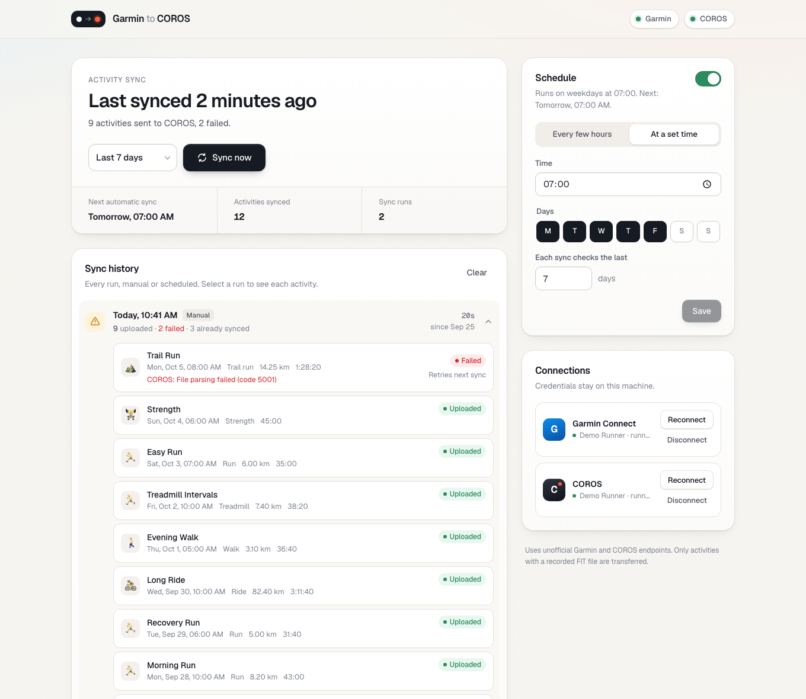

# Garmin → COROS Sync

A small self-hosted web app that copies your **completed Garmin Connect activities** (original FIT files) into **COROS Training Hub**.

- **Manual sync**: click *Sync now* and choose how far back to look (today up to 365 days).
- **Scheduled sync**: every N hours, or at a set time on chosen weekdays.
- **History**: every run is logged with its trigger, counts and duration. Expand a run to see each activity's outcome (uploaded, processing, skipped or failed) and the error message for anything that failed.



## Quick start (Docker Compose)

On the machine that will host it:

```bash
git clone <this repo> garmin-coros-sync && cd garmin-coros-sync
cp .env.example .env        # optional: set TZ, APP_PASSWORD, BIND_ADDRESS, PORT
docker compose up -d --build
```

1. Open `http://<host>:8484`. By default the port only listens on the host's localhost, so either browse from that machine, use an SSH tunnel (`ssh -L 8484:localhost:8484 <host>`), or set `BIND_ADDRESS=0.0.0.0` together with `APP_PASSWORD`.
2. Connect **Garmin**. If your account uses two-step verification you'll be asked for the code.
3. Connect **COROS**.
4. Click **Sync now**, then switch on a **Schedule**.

The container restarts automatically (`restart: unless-stopped`), so scheduled syncs keep running across reboots.

### Configuration (`.env`)

| Variable       | Default         | Purpose                                                                        |
| -------------- | --------------- | ------------------------------------------------------------------------------ |
| `BIND_ADDRESS` | `127.0.0.1`     | Host interface to publish on. Use `0.0.0.0` for LAN access.                     |
| `PORT`         | `8484`          | Host port.                                                                     |
| `TZ`           | `Europe/London` | Timezone for schedules (e.g. "daily at 07:00") and the timezone sent to COROS.  |
| `APP_PASSWORD` | empty           | If set, the UI requires HTTP basic auth (any username).                        |

### Data and backups

Everything is stored in the `sync-data` named volume at `/data`: the SQLite DB with your history, saved credentials, and the Garmin tokens.

```bash
docker compose logs -f                                   # follow sync logs
docker compose cp garmin-coros-sync:/data ./data-backup  # back up the volume
docker compose down -v                                   # remove the container AND the volume (wipes credentials/history)
```

To update after pulling new code, run `docker compose up -d --build`. The volume is kept.

The container runs as an unprivileged user and has a `/healthz` healthcheck. It runs a single process because the scheduler lives in the web process. Don't scale it to more than one replica, or syncs would run twice.

### Running without Docker

```bash
./run.sh   # creates .venv, installs deps, serves http://127.0.0.1:8484 (Python 3.12+)
```

Locally, `HOST`, `PORT`, `APP_PASSWORD` and `SYNC_DATA_DIR` (default `./data`) are read from the environment.

## How it works

```
Garmin Connect ──(garminconnect lib)──► original FIT ──► zip ──► COROS S3 bucket ──► activity/fit/import
```

- **Garmin** uses the maintained [`garminconnect`](https://github.com/cyberjunky/python-garminconnect) library. (`garth` is deprecated and no longer handles Garmin's login.) OAuth tokens are cached in `data/garmin_tokens/` and refresh on their own, so you shouldn't need to enter an MFA code again unless Garmin revokes the session.
- **COROS** has no public upload API, so the app does what the Training Hub web app does:
  1. Log in.
  2. Get temporary storage credentials.
  3. Upload `{md5}.zip` to the account region's bucket.
  4. Register the upload with `activity/fit/import`.
- **No duplicate uploads**: every Garmin activity ID that has been uploaded (or deliberately skipped) is recorded, so overlapping sync windows won't upload anything twice. Failed activities aren't recorded, so the next run tries them again. Use **Re-sync next time** on a history item if you want an activity uploaded again.
- **Skipped activities**: manual entries and GPX/TCX imports have no FIT file, so they're skipped.

## Security notes

- Everything stays on your machine. `data/` is created with mode `0700`, and the DB file with `0600`.
- Your Garmin and COROS passwords are stored in the local SQLite DB **unencrypted**. Unattended runs need them to log in again when a session expires. Don't expose the app to the internet without `APP_PASSWORD` and TLS in front of it.
- **Disconnect** deletes the stored credentials and tokens.

## Limitations

- Both integrations use **unofficial, reverse-engineered endpoints**. Garmin or COROS can change them at any time and break syncing.
- COROS **China** and **Singapore** region accounts store uploads on Aliyun OSS, which isn't supported yet. US and EU accounts (AWS S3) are supported.
- The app syncs completed activities only. It doesn't sync structured workouts or training plans.

## Project layout

```
app/
  main.py            FastAPI routes + static hosting + optional basic auth
  sync.py            Sync engine (background thread, de-dup, per-item results)
  scheduler.py       APScheduler wrapper (interval / daily-at-time)
  garmin_service.py  Garmin login (incl. MFA), activity listing, FIT download
  coros_client.py    COROS login, STS credentials, S3 SigV4 upload, import
  db.py              SQLite: settings, runs, items, synced IDs
static/              Vanilla HTML/CSS/JS UI (no build step)
Dockerfile           Image (python:3.13-slim, non-root, healthcheck)
compose.yaml         Service + persistent volume
.env.example         Compose settings template
```
